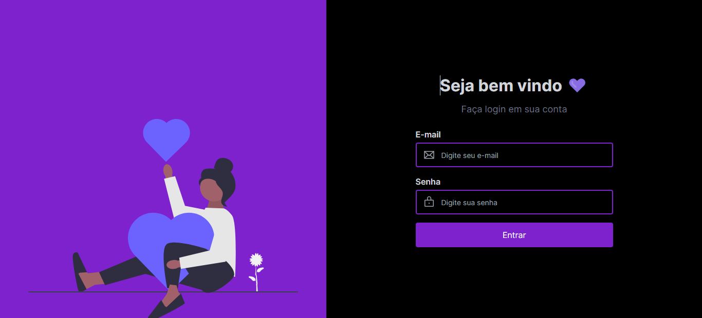

<p align="center">
 

  
</p>

# Tecnologias

🚀 Esse projeto foi desenvolvido com as seguintes tecnologias:

- ReactJS
- Vite
- Tailwind CSS
- Typescript
- Storybook
- Radix-ui
- Phosphor-react

</br>

### Como rodar o projeto

```bash
# Clone este repositório
$ git clone tailwindcss-template-login-screen

# Acesse a pasta do projeto no terminal/cmd
$ cd tailwindcss-template-login-screen 

# Instale as dependências
$ npm i or yarn

# Execute a aplicação em modo de desenvolvimento
$ npm run dev or yarn dev

```

### Para rodar e ver a documentação do storybook:

```bash

# Execute a aplicação em modo de desenvolvimento
$ npm run storybook

```

</br>

<h1 align="center"> 
	Projeto  
</h1>

<h1 align="center">
  
</h1>